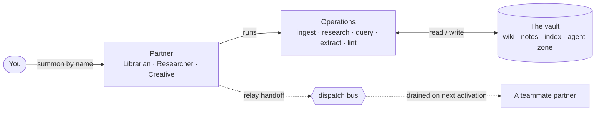
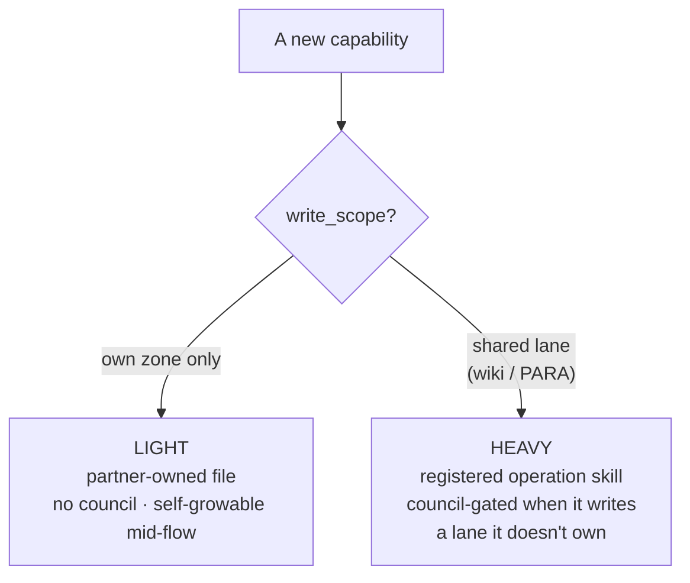

# Vault (`vlt`) — a self-evolving cast of knowledge partners

A BMad module that turns an LLM-maintained knowledge wiki from *a toolbox of skills you invoke*
into *a cast of distinct AI partners who share one brain — the vault — and can grow themselves*.
Install it into a vault (existing or fresh) and the cast grows itself.

The roster ships with three partners — a **Librarian** who tends the wiki, a **Researcher** who
pushes you to learn, and a **Creative** who turns curated knowledge into made things. They share one
living vault, hand work to each other through it, and can mint new partners and abilities on their
own. **14 skills in all.**

## What Vault is

Most "AI knowledge base" setups are a pile of prompts and a folder of notes. Vault is different in
three ways that compound:

- **It's a cast, not a toolbox.** You summon a *partner* by name and it stays in character —
  remembering your bond, your open threads, and what it learned last session. Partners run shared
  *operations* (ingest, research, query…) as their verbs.
- **It ships its own rulebook.** The rules that keep a vault coherent — what may be written where,
  how pages are named, how sources are cited — travel *inside the module* as a **governance bundle**,
  so a fresh vault inherits a complete, working constitution instead of you hand-writing one.
- **It grows itself, durably.** Partners can mint new abilities and new partners (`vlt-mint`), gated
  by a review council where the blast radius warrants it — and your local evolution **survives module
  upgrades** by design.

The rest of this README walks the cast, then how a vault works day-to-day, then the two things that
make it more than a skill bundle: **self-evolution** and **durability**.

## Meet the cast

Three partners ship in the box. Each is a real persona with its own memory (an `identity.md` for the
bond and a `thread.md` for open inquiry), summoned by invoking its skill (e.g. `/vlt-agent-librarian`)
or by calling it by name.

| Partner | What it's for | Reaches for |
|---|---|---|
| 📖 **Librarian** (`vlt-agent-librarian`) | Tends the wiki. Brings sources in cleanly, keeps one canonical home per concept, runs health checks. Calm, custodial, protective of coherence. | `vlt-ingest`, `vlt-lint`, `vlt-query` |
| 🔬 **Researcher** (`vlt-agent-researcher`) | Your intellectual sparring partner. Goes to the web, argues with the material, pushes you to think harder — then hands findings to the Librarian to file. | `vlt-research`, `vlt-query` |
| 🎨 **Creative** (`vlt-agent-creative`) | Turns curated knowledge into deliverables — briefs, dashboards, resource docs. Taste-driven, production-focused, challenges you toward *making*. | `vlt-extract`, `vlt-query` |

Partners never call each other directly. When the Researcher finds something the Librarian should
file, it leaves a pointer in shared vault state and the Librarian picks it up. The vault *is* the
message bus.

## How a vault works day-to-day

A partner's job is to run **operations** — the workhorse verbs — against shared vault state, and to
hand durable work to the right teammate when it crosses into another's lane.



**The operations** (any partner can run them; they also work headless):

- **`vlt-ingest`** — the *single writer* of canonical wiki pages. Brings a source (file, URL, or
  text) in, updates existing pages, surfaces contradictions instead of smoothing them, keeps the
  index accurate. Scans for credentials before writing.
- **`vlt-research`** — investigates a sharp question against the web and files a standalone research
  note. Builds new knowledge; leaves wiki integration to the Librarian. Survives interruption via a
  work-in-progress file.
- **`vlt-query`** — answers from the **wiki only**, no web reach. Grounds every claim in a cited
  page, ranks contradictions, and admits when "the wiki is thin here."
- **`vlt-extract`** — shapes wiki knowledge into a PARA deliverable (project brief, area dashboard,
  resource doc) for a specific reader and purpose. Every claim traces back to a wiki page.
- **`vlt-lint`** — health-checks the wiki: orphans, stale claims, contradictions, near-duplicate
  pages, index drift. Auto-fixes the safe structural issues, files the rest to the backlog.

**The dispatch bus (`vlt-dispatch`)** is how work moves between partners — one shared record, three
modes: **`daily`** routes your daily-note captures to the partner who serves them, **`relay`** lets
one partner leave a pre-addressed handoff for another, and **`ledger`** is a read-only board of open
items. The **relay reflex** closes the loop: after a partner writes a durable handoff document, it
fires a relay so a pointer lands in the recipient's slice, drained on that partner's next activation.

## It grows itself

This is the headline. The cast isn't fixed — partners can build new abilities and even new
teammates, mid-conversation, when they notice recurring friction. The engine is **`vlt-mint`**, and
it's a capability *every partner has*, not a separate tool you visit ("I keep needing X — let me build
myself X").

**Capabilities are first-class objects.** When something new is built, the owner declares one thing —
its **`write_scope`** — and everything else (its weight, its home, whether a council must review it)
*derives* from that:



- **Light capabilities** touch only the owning partner's own zone — so they need no ceremony. A
  partner can grow one in the middle of a conversation by logging a single line.
- **Heavy capabilities** write a *shared* lane (canonical wiki pages, PARA deliverables) — so they're
  registered operation skills (the `vlt-*` ops you've met) and get reviewed when they'd touch a lane
  they don't own.

**Minting is phased and gated.** A capability or partner that warrants review runs through three
explicit phases with exit gates — **Ideate** (resolve the brief, you confirm) → **Validate**
(blast-radius review by the **`vlt-review-council`**, a fixed panel of persona lenses that argue in
parallel while a moderator synthesizes a verdict) → **Build** (author, install, register, verify) —
backed by a resumable planning doc so a mint survives an interrupted session. The governing
discipline: **capture is cheap and never gated; acting is deliberate.** A partner can file a backlog
item the instant it notices friction, but building from it always passes the gate.

**Worn, not minted — `vlt-track`.** Some abilities are *shared*. `vlt-track` is the verb for running
a program across weeks — design a protocol, log progress, review and adjust. It's "one verb, many
subjects": a single shared operation that encodes the loop, while each partner that uses it brings its
own voice and a **loop profile** (where the working record lives, what to watch). A domain partner
*wears* it by adding a pointer, rather than minting a duplicate — the clearest worked example of the
capability model in action.

## Durable by design

Self-evolution is only worth having if your evolution **survives the next module update**. Vault's
durability principle: *two classes of evolution, two fates.* Generic improvements flow upstream into
the module and arrive on upgrade; **your** vault-specific evolution — minted partners, local rule
tweaks, mint history — is reconciled by **merge, never replace**.

- **The governance bundle** ships with the module: an **operating contract** (the vault's
  constitution — what agents may write where, the research-vs-wiki distinction, naming, the activation
  ritual, handoff rules), a set of **conventions** (frontmatter, indexing, supersession,
  consolidation, extraction), and the council's **review-lens personas**. A fresh vault inherits all
  of it.
- **The version handshake** keeps rules and the skills that obey them in sync. Each convention
  publishes a `version:` and its `consumers:`; each consuming skill pins `depends_on: ["frontmatter@1", …]`
  recording the version it last reconciled against. The version advances only when someone
  *deliberately reconciles and records it* — and `vlt-lint` flags any consumer that has fallen behind.
  "Did everyone who depends on this rule get updated?" becomes machine-checkable.
- **Append-only overlays** keep your local rule edits upgrade-safe. Base conventions stay pristine and
  overwrite-safe; your additions live in a separate `_agent/conventions/{name}.overlay.md`, and skills
  merge base + overlay on read. The collision *never forms*, so an upgrade can always cleanly refresh
  the base.
- **`vlt-upgrade`** owns *safe* upgrades end to end: pre-flight (snapshot your divergence into an
  append-only ledger while the vault is intact) → apply (merge-copy new bits with no destruction) →
  reconcile (preserve minted partners *and* their registration, refresh overlays/baselines, run
  idempotent migrations) → post-flight divergence report. A generic installer can't silently destroy a
  vault's hard-won evolution.

`vlt-lint` is the net under all of this — beyond wiki hygiene it enforces the version handshake,
overlay/baseline integrity, capability lane-safety, and a **personalized-extraction firewall** (every
method claim must trace to a cited wiki source; a partner's own operational data is cited separately
in `personalization_sources:` and never smuggled in as general knowledge). Coherence stays a
*checkable property*, not a hope.

## The full skill roster

All 14 skills, grouped:

| Group | Skills | Role |
|---|---|---|
| **Partners** | `vlt-agent-librarian`, `vlt-agent-researcher`, `vlt-agent-creative` | The cast you summon — personas with memory. |
| **Operations** | `vlt-ingest`, `vlt-research`, `vlt-query`, `vlt-extract`, `vlt-lint`, `vlt-dispatch` | The verbs partners run against the vault. |
| **Shared hand** | `vlt-track` | A longitudinal loop any partner can *wear*. |
| **Self-evolution** | `vlt-mint`, `vlt-review-council` | Grow the cast; gate the growth. |
| **Lifecycle** | `vlt-setup`, `vlt-upgrade` | Install/provision; upgrade durably. |

**Self-contained:** the governance bundle (operating contract + conventions + review-lens personas)
ships inside `vlt-setup/assets/` and installs into each target vault at setup.

## Install

Vault is a standard BMad module, installed with the **BMad installer**. **The vault is the
project** — install Vault *into* each vault you want a cast for, and run setup there. There is no
external registry; one vault = one install.

Run the installer with the vault as your working directory, pointing `--custom-source` at this
module's Git URL:

```bash
cd /path/to/your/vault

npx bmad-method install --custom-source https://github.com/mggower/bmad-module-vlt --tools claude-code
```

Or run `npx bmad-method install` interactively and give it the source URL when prompted. (A local
checkout works too — point `--custom-source` at the repo path instead.)

The installer reads `.claude-plugin/marketplace.json`, copies the `vlt-*` skills into the
vault's `.claude/skills/`, and runs `vlt-setup`, which installs the governance bundle into the
vault's `_meta/`, writes a `CLAUDE.md` pointer, and scaffolds the partner + backlog layer. Setup is
**additive and non-invasive** — it only writes Vault's own config and never touches another
module's.

**Multiple vaults** (e.g. work + personal): install into each — that's the whole multi-vault story.
Each vault keeps its own cast, threads, and backlog. **Updating:** re-run the installer in a vault
to pull a newer module version; re-running `vlt-setup` refreshes registration (governance install
is skip-if-present, so local rule edits are preserved).

## Recommended companion (optional)

Vault is **standalone** — it degrades gracefully and never hard-requires another module. One
companion makes it *fuller*, and `vlt-setup` will tell you if it's missing:

- **`bmad-agent-builder`** (from the **BMad Builder / BMB** module) — only used by `vlt-mint`'s
  *deliberate, from-scratch* partner-minting path, for a richer persona-discovery interview.
  Without it, `vlt-mint` still mints partners and operations via its bundled in-flow templates — you
  just lose the guided interview. Install BMB (via the BMad installer or as a plugin) if you want
  it; `vlt-mint` picks it up automatically.
- **`bmad-brainstorming` / `deep-research`** — the Researcher reaches for these mid-flow when
  present; otherwise it proceeds with available web tooling and says so.

There is no way (and no need) to *force* these at install time: BMad's philosophy — and Vault's
design — is detect → warn → degrade, never block.

## A vault ≠ this repo

This repo is **module development**. A *vault* is whatever folder holds your knowledge wiki (e.g.
`~/my-vault`); you register its path during `/vlt-setup`, and the module provisions it. Install
Vault into each vault you want a cast for; each keeps its own wiki, partner threads, and backlog.

## Notable files

- `.claude-plugin/marketplace.json` — the plugin manifest; lists the 14 `vlt-*` skills the installer copies.
- `skills/` — the 14 `vlt-*` skills (the installable module).
- `skills/vlt-setup/assets/governance/_meta/` — the canonical governance bundle (pruned conventions, review-lens personas, operating contract) that `vlt-setup` installs into a vault. Edit the bundle here (single source).
- `skills/reports/` — module-development build briefs and the evolution roadmap (how the cast itself was grown).
